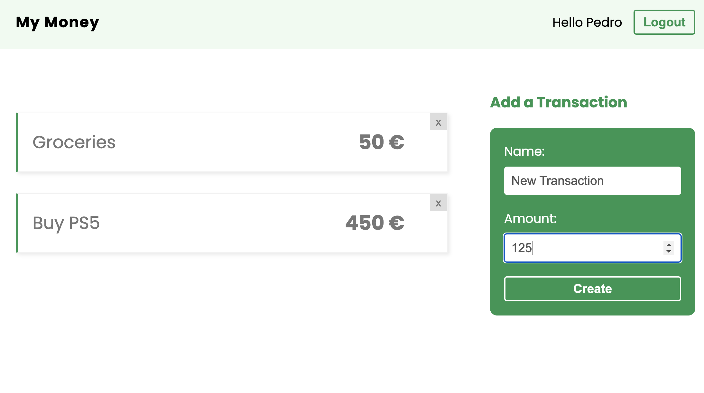

# React_MyMoney

Repository created following this [Udemy Course](https://www.udemy.com/course/build-web-apps-with-react-firebase/) to practice the following React concepts:

- Custom Hooks
- Context
- Reducers
- Firebase Authentication
- Firebase Firestore
- Firestore Rules
- Firebase Hosting

## Application

Once you get into the application you will see a Login / Signup page in order for you to authenticate with Firebase Authentication service. Once you authenticate, you will see a list of transactions created by you on the left and a quick form in order to create more on the right, pretty simple application but with fair amount of complexityB



## Run Locally

Clone the project

```bash
  git clone https://github.com/pedrolopezbiedma/React_MyMoney.git
```

Install dependencies

```bash
  npm install
```

Set up Firebase connection.

- Create a firebase project.
- For the project, initialize a firestore database & authentication.
- Create a web app for the project.
- Grab the project config and set it up into the firebase folder within the local project

Start the application

```bash
  npm run start
```

## Authors

- [@pedrolopezbiedma](https://github.com/pedrolopezbiedma)
